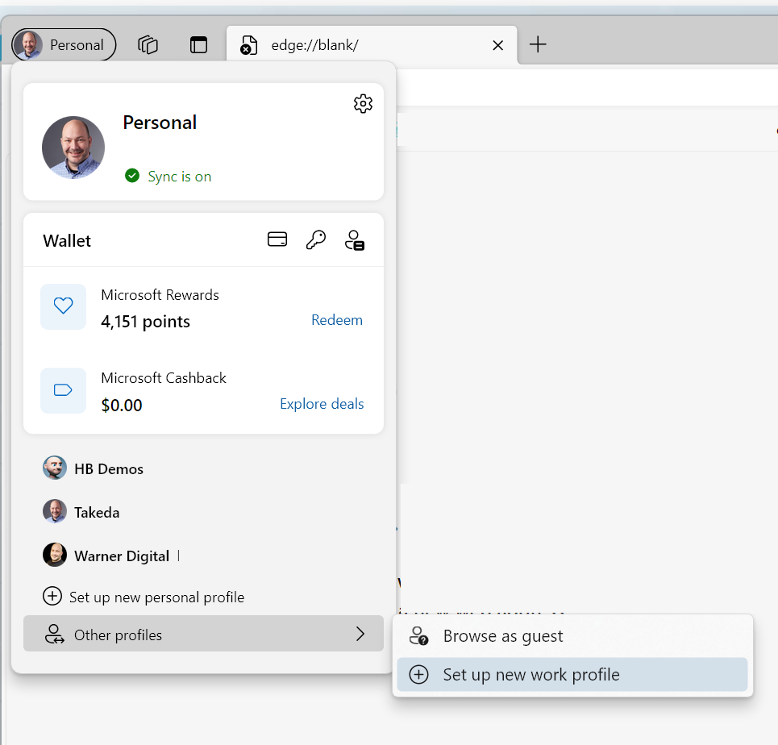
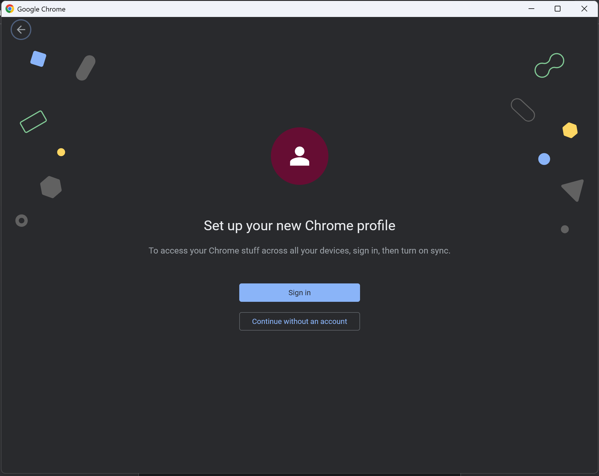

# Lab 1: Pre-requisites

>:exclamation: This lab is only required if you do not have already have administrative access to a Microsoft 365 tenant and/or a Dataverse environment, or if you do not already use browser profiles to log-in between tenants.
>
> If you already have the pre-requisites, please skip ahead to [Lab 2](../Lab02/README.MD).

The instructions in this lab will provide you with a free full Microsoft 365 development environment, which will automatically reset approximately every 90 days, unless you continue using it for development purposes.

Do not use this environment for your production data!

## Exercise 1: Create a browser profile (optional, but recommended)

When using multiple Microsoft 365 tenants, we recommend using browser profiles to avoid issues related to passing authentication context between tenants.

### If using Microsoft Edge

To create a new browser profile on Microsoft Edge, follow these steps:

1. Open Microsoft Edge
1. From the upper-left corner, tap on the avatar icon (or avatar image) and select , select **Other profile**, followed by **Set up a new work profile**.
    

1. On the **Welcome to Microsoft Edge, the best performing browser on Windows** dialog, select **Start without your data** (because this profile, in theory, is new and there is nothing to sync!!!)  
   
1. Select the privacy option which suits you the best, and select **Confirm and start browsing**
      
1. From here, you can start browsing to <https://developer.microsoft.com/microsoft-365/dev-program> and follow the instructions to create your development tenant (see below, Exercise 2)
1. Your browser history, credentials, and bookmarks will persist for each browser profile. You can switch between profiles by selecting the avatar icon and picking from the profiles menu.
   
   (As you can see, I have a few profiles)  

### If using Chrome

To create a new user profile on Chrome, follow these steps:

1. Open Chrome
1. Select the avatar icon, in the upper right corner (which may show your profile image or a letter associated to your username). Under **Other profiles**, select **Add**
     
1. In the **Set up your new Chrome profile** dialog, select **Continue without an account**
   
1. In the **Customize your Chrome profile**, select the customization options you want to use to distinguish your workshop profile from your main profile and select **Done**
1. From here, you can start browsing to <https://developer.microsoft.com/microsoft-365/dev-program> and follow the instructions to create your development tenant (see below)
1. Your browser history, credentials, and bookmarks will persist for each browser profile. You can switch between profiles by selecting the avatar icon and picking from the profiles menu, under **Other profiles**.

## Exercise 2: Create your developer tenant
 
Using your own developer tenant will allow you to do some of the more advanced labs without having to worry about introducing changes to your production environment, or -- even worse -- having to beg your IT admins for permissions.

It is completely free, and your tenant will continue to renew every 90 days, or so, as long as you continue using it for development purposes.

It is a full production tenant, but you should make sure to treat it as a development environment only (e.g. don't use it as your new email domain or to store important business document).

Please follow your employer's security guidelines when using your development tenant. Do not store your company's un-redacted production data in your dev tenant, even if it is simply for testing purposes.

> If you skip this step, you will not be able to complete many of the labs in the latter half of this workshop. You've been warned!

1. Using your browser in a new browser profile that you have just created, browse to <https://developer.microsoft.com/microsoft-365/dev-program>
1. Under **Join the Microsoft 365 Developer Program Today!**, select **Join now**
1. When prompted to log-in, use your own Microsoft credentials (e.g. live.com, outlook.com -- not your corporate email address)
   > If you do not want to use your personal email address, you can create a new one by visiting https://live.com 
1. On the **Join the Microsoft Developer Program!** page, select **United States** for your **Country/Region** (this lab will use preview features that -- at this time -- may not appear in other countries)
   
1. In the **Company** field, type a fictitious company that you want to use for your development tenant. For example, if your name is `Luise`, you may wish to use `Luise Dev`. **Do not use your work company name**
1. Select your **Language preference** and accept the terms and conditions. Whether you wish to receive information, tips, and offers is entirely up to you. Select **Next**
1. Select your **primary focus** and select **Next**
   
1. When prompted **What areas of Microsoft 365 development are you interested in?**, select whichever options you wish, but you *may* want to select **Power Platform** at a minimum. Select **Save**
   
1. In the **Set up your Microsoft 365 E5 sandbox** dialog, when prompted to **Choose your Microsoft 365 E5 developer sandbox**, select **Instant sandbox**, and select **Next**. We won't have enough time today to configure your own sandbox from scratch.
   
1. In the **Set up your Microsoft 365 E5 instant sandbox**, provide your desired **Admin username** (it will be unique to your tenant, so you can simply use your first name if you wish to)
1. Provide a new **Admin password** for your admin user (let's use a *new* password, shall we?!). Re-enter your new password in **Confirm admin password**.
   
1. By default, the system will create an additional 16 users with fictitious names and your same password to be used as for testing purposes. You may choose to enter a new alternative user password under **Use alternative password for all 16 fictitious users**
1. Select **Continue**
1. In the **Add phone number for security**, enter your mobile **Phone number** (and select the appropriate **Country code**), then select **Send code**
1. When you receive a code on your mobile device, enter the code and select **Set up**
    > If you get an error message when entering your phone number, it may be because you used your phone number too many times to create other developer tenants. A-hem, at least that's what I heard.
1. when your tenant setup is complete, it will redirect you to **Your Microsoft 365 developer subscriptions**, where it should display your tenant's **Domain name**
1. Select **Go to subscription**. If prompted to log-in, use the new admin credentials you configured for your tenants.
1. It may take a few moments for your tenant provisioning to complete. Click through the introduction guidance, and you should see the **Get started** page.
  

## Exercise 3: Adding trial licenses

Many of the labs in this workshop will require you to get access to full Power Apps Per User license. To add some trial licenses, follow these steps:

1. From the **[Get started](<https://www.office.com/?auth=2>)** page, select the **Admin** icon in the navigation.
2. In the **Microsoft 365 admin center**, select **Billing**, followed by **Billing accounts**
3. Select the billing account associated to your developer tenant and enter your **Sold to address** to your own address, then hit **Save**.
4. In the left navigation, select **Purchase services**
5. In the **Purchase services** page, search for **Power Apps per user plan**. Select **Details**
6. In the **Power Apps per user plan** page, select **Start free trial**.
7. In the **Check out** page, select **Try now**
8. In the **Order receipt**, select **Continue**
9. While in the same browser profile, browse to <https://aka.ms/ppac>, which will take you to the **Power Platform Admin Center**
10. From the **Power Platform Admin Center**, select **Environments**
11. From the list of environments, select the one with the word **(default)** (there should be only one environment at this time)
12. In the environment details page, under **Environment admin**, select **See all**
13. In the **Environment Admin**, select **+ Add users**
14. In the **Add people to the Environment Admin security role** pane, enter your admin username and select **Add**
15. Using the breadcrumb at the top of the page, select your default environment to return to the environment details.
16. In the **Details** area, select **Edit**
17. In the **Edit details** pane, change the environment **Name** to **Personal productivity (default)** and select **Save**. This will rename your default environment, which is part of a sound [environment strategy](https://learn.microsoft.com/microsoft-365/community/defining-a-power-platform-environment-strategy#why-is-the-default-environment-special)

## Exercise 4: Create a Dataverse development environment

While we're on the subject of [environment strategy](https://learn.microsoft.com/microsoft-365/community/defining-a-power-platform-environment-strategy#recommendations--best-practices), it is always a good idea to use a development Dataverse environment to build your apps, whether it is a personal, departmental, or application one.

A personal development environment uses the Power Apps Developer Plan. It gives you perpetual access to the same Power Apps functionality available in paid plans (aligned with Trials), including Dataverse and Power Automate, but in a developer environment meant for development and test use only. A paid plan is required to deploy or run solutions in a production environment for production use.

For this workshop, we'll setup a personal development environment using the following steps:

1. From your workshop browser profile, navigate to <https://powerapps.microsoft.com/developerplan/>
2. In the **Power Apps Developer Plan**, select **Existing user? Add a dev Environments**. You may be prompted to log in.
3. On the **Hello *your name*** page, select **Accept** (after, of course, reading the terms of use and privacy statement)
4. After a short while, you'll see a **Contact Information** dialog. Confirm your information and select **Submit**
5. When completed, you should see a environment with your name on it. This is the environment we'll use for the majority of our labs Today
   

## Next steps

Now that you have an environment where you have full access, let's get started with [setting SharePoint up](1-setting-sharepoint-up.md)

