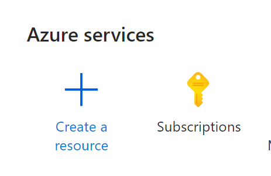
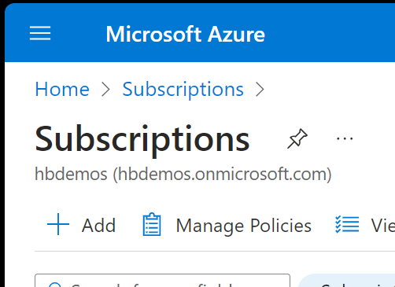
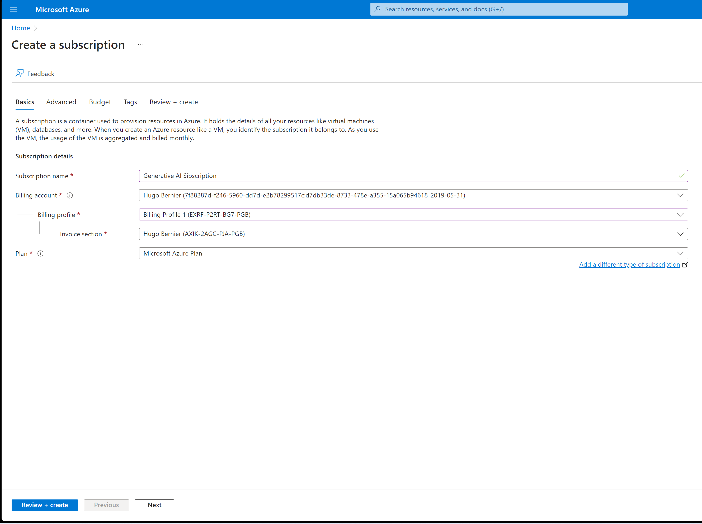
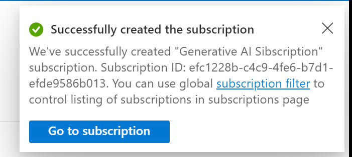
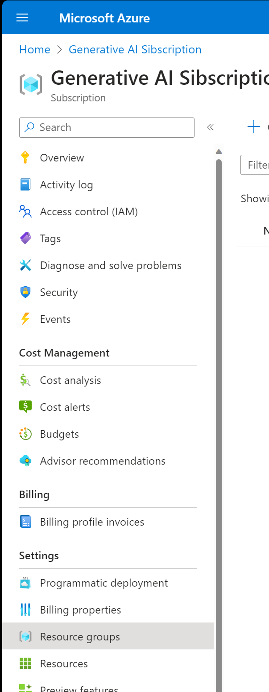
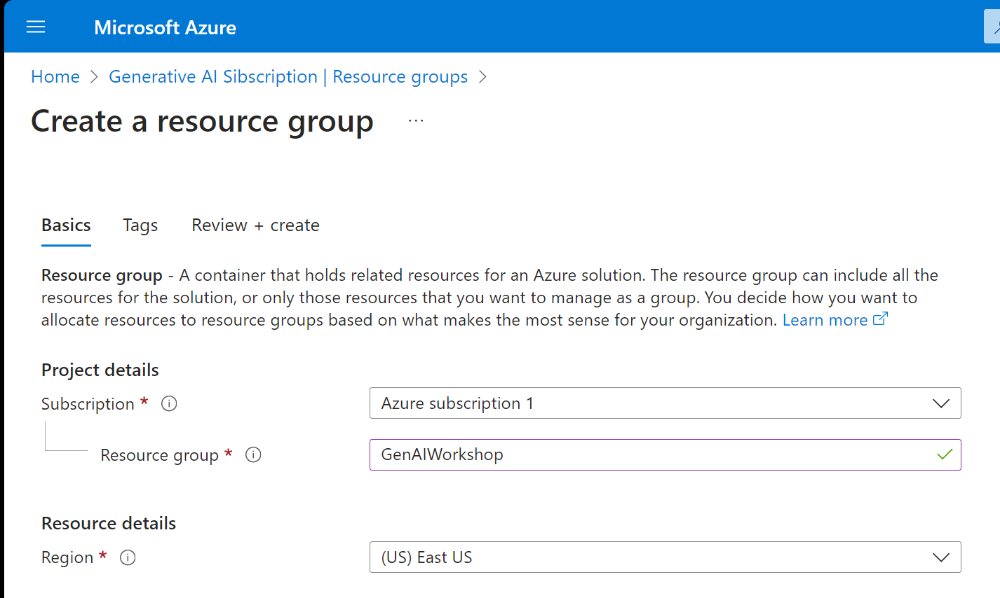

# Lab 2: Create an Azure Subscription

## Exercise 1: Create an Azure Subscription

1. Using your new browser profile, navigate to the [Azure portal](https://portal.azure.com) <https://portal.azure.com>.
1. Sign in to the Azure portal with your new credentials that you created in the previous lab (you wrote down your credentials, right?).
1. From the Azure portal, select **Subscriptions**, under **Azure services**.
   
1. From the **Subscriptions** page, Select **Add**.
   
1. On the **Select an offer for your subscription** page, select an offer that meets your needs and use **Select offer**. 

    > **Note**: If you have a university or school email address, you can use the **Azure for Students** offer, which does not require a credit card. Otherwise, you can use a trial offer, which (unfortunately) requires a credit card, but may provide you with enough credits to continue this workshop.
1. Select **Review + create**.
   
1. Review the subscription details and the terms of use, and then select **Create**.
1. Wait for the subscription to be activated, and then select **Go to subscription**.
   

1. You'll use this subscription for the rest of the workshop. Take a moment to review the subscription details and the resources available to you.

> **IMPORTANT**
> If you choose to use a subscription that requires a credit card, be sure to delete the subscription when you are done with this workshop to avoid incurring charges. You can do this by selecting **Subscriptions** from the Azure portal, selecting the subscription, and then selecting **Delete**. Trust us, we speak from experience.
>
## Exercise 2: Create a resource group

Resource groups are used to...uh... group resources together. They are also used to manage access control and billing. You can think of a resource group as a container that holds related resources for an Azure solution. The resource group can include all the resources for the solution, or only those resources that you want to manage as a group. You decide how you want to allocate resources to resource groups based on what makes the most sense for your organization

For this workshop, you'll create a resource group to hold the resources you'll need to complete all our labs.

1. From the Azure portal, within your new subscription, select **Resource groups** from the left-hand menu.
   
1. In the **Resource Groups** page, select **Create**.
1. In the **Create a resource group** page, enter the following details:
   - **Subscription**: Select the subscription you created in the previous exercise.
   - **Resource group**: Enter a name for the resource group. For example, `GenAIWorkshop` (no spaces).
   - **Region**: Select a region that is close to you. For example, `East US`.
1. Select **Review + create**.
   
1. Review the details and select **Create**.