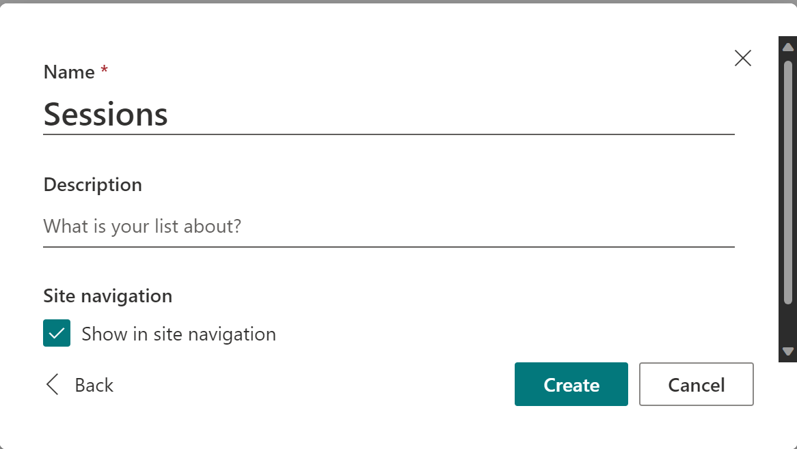
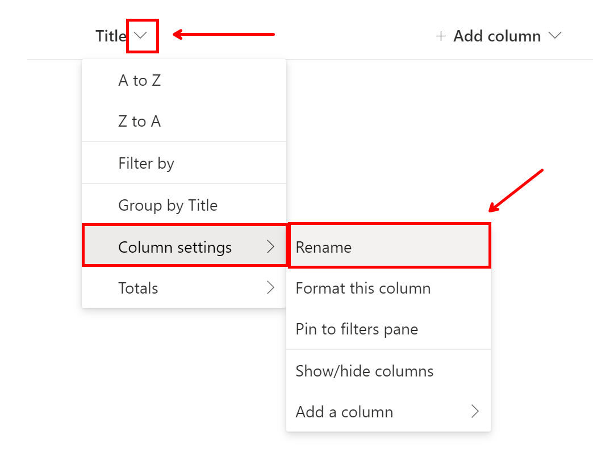

# Lab 1: Setting SharePoint Up

In this lab, we will configure a SharePoint site and some lists that are needed to manage our speakers and agendas for our conferences.

## Scenario

Hawkins Labs started as a small research company, but grew quickly to 2,000 employees thanks to a scientific research contract for the Department of Energy.

To help keep all employees informed on the latest research and strict security protocols around the experiments, the small, but mighty, skilling team has been arranging small -- employees only -- conferences.

The conferences have been so successful, in fact, that they need systems to facilitate the coordination of speakers for the conferences. They also need to manage agendas, and provide attendees with ways to select which conference sessions they wish to attend.

Unfortunately, the IT department has been busy dealing with network and computer outages due to power fluctuations in the area, and they will not be able to create the applications -- or, at least, not until *after* the next conference is scheduled to occur.

You and your team will have to create everything you need to manage the conference.

You talked to your friends in the IT department, and agree that you'll use the tools that are at your disposal -- like SharePoint -- to manage the data you need for the conference.

Hopefully, the IT team will be able to help improve your solution in time before the next conference.

## Pre-requisites

For this lab, you'll need:

- Access to a SharePoint online tenant

## Exercise 1: Create a SharePoint site

1. Using your workshop browser profile, browse to https://www.office.com 
2. Using the "waffle" menu (in the upper left corner), select **SharePoint**
     
3. From the **SharePoint** page, select **+ Create site**
4. In the **Create a site**, select **Communication site**
   > **Team site or Communication site?**
   >
   > When creating a SharePoint site, you have to pick the type of site. Which one should you pick?
   >
   > **Team sites** should be used as private spaces to collaborate with a team, while **Communication sites** are intended to share information with others. For the purpose of this lab, we need a Communication site because we need an app to share conference information with employees.
5. When prompted to enter a **Site name**, enter **Skilling events**, then select **Finish**
6. If prompted to select a template, you can skip this part.

## Exercise 2: Create a Sessions list

The Sessions list will be used to track sessions, along with speaker information, acceptance status, and a few other things needed by show a conference agenda.

1. From your newly created site, select the **Settings** icon in the upper-right corner, followed by **Site contents**
2. In the **Site contents** page, select **+ New**, then **List**
3. In the **Create a list** dialog, select **+ Blank list**
4. When prompted to do so, enter **Sessions** in the **Name** field, then select **Create**
   
   > If you were building this list for a real solution, you would probably want to uncheck **Show in site navigation**, but since we'll use this list quite a bit for our workshops, we'll keep it in the navigation bar to save some time.
5. When the list is created, select the context menu to the right of the **Title** column, select **Column settings** and **Rename**
   
6. In the **Rename column** dialog, change the **Name** to **Session title**, then select **Save**.
     
7. Using **+ Add column**, add the following columns to the list
   Column name | Column type| Notes
   ---|---|---
   **Session code**| Single line of text|
   **Speaker**|Single line of text|
   **Session type**|Choice|Choice options: Meal Keynote Breakout Workshop Panel Talk Networking
    **Description**|Multiple lines of text|
    **Start date and time**|Date and time|Include time: **Yes**
    **End date and time**|Date and time|Include time: **Yes**
    **Capacity**|Number|
    **Location**|Choice|Choice options: Room 1 Room 2 Room 3 Room 4 Expo Hall Keynote Room
    **Notes**|Multiple lines of text
    **Speaker profile pic**|Hyperlink
    **Job title**|Single line of text
    **Bio**|Multiple lines of text
    **Status**|Choice|Choice options: Submitted Nominated Accepted Declined Accepted - Notification Sent Declined - Notification Sent
8. Using **+ Add column**, select **More...**
9. In the **Create Column** page, enter **Duration** in the **Column name**, for column **Type**, select **Calculated**. Check **Use calculated value**. Set the **data type returned from this formula is:** to **Single line of text**. In the **Formula** column, enter the following value:
    > =CONCATENATE(IF(INT(([End date and time]-[Start date and time])*24)>0,CONCATENATE(INT(([End date and time]-[Start date and time])*24)," ",IF(INT(([End date and time]-[Start date and time])*24)>1,"hours","hour")),""),IF(MINUTE([End date and time]-[Start date and time])>0,CONCATENATE(" ",MINUTE([End date and time]-[Start date and time])," ",IF(MINUTE([End date and time]-[Start date and time])>1,"minutes","minute")),""))

## Exercise 3: Creating a Schedules list

The Schedules list will keep track of which sessions have been added by which conference attendee.

1. From your newly created site, select the **Settings** icon in the upper-right corner, followed by **Site contents**
2. In the **Site contents** page, select **+ New**, then **List**
3. In the **Create a list** dialog, select **+ Blank list**
4. When prompted to do so, enter **Schedules** in the **Name** field, then select **Create**
5. When the list is created, add the following columns to the list
   Column name | Column type| Notes
   ---|---|---
   **User**| Person|
   **Date**|Date and time|
   **Location**|Single line of text|
    **Speaker**|Single line of text|
    **SessionID**|Number

## Next steps

Armed with a SharePoint site and a few lists, we're ready to start building some apps, with [Building an app](2-building-an-app.md)

