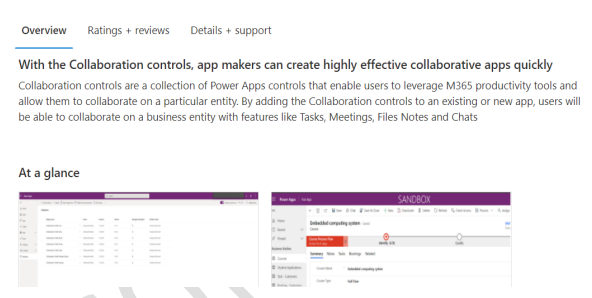
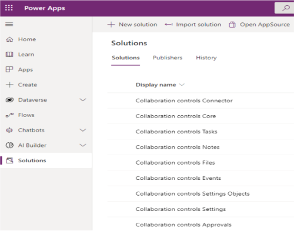

# Install Collaboration controls

In this article, you'll learn how to install Collaboration Controls. The following are required to build and deploy Collaboration Manager applications using the Collaboration controls:

* **Power apps**: To build and run Model Driven Applications using the Collaboration controls.
* **M365 E3 or higher**: To deploy custom applications to Microsoft Teams and store tasks in Planner, files in SharePoint, and meetings in Outlook.

## Install the Collaboration controls solutions

You'll install the Collaboration controls into your dataverse environment via [Microsoft AppSource.](https://appsource.microsoft.com/product/dynamics-365/mscm.collaboration-toolkit-preview?flightCodes=collaborationcontrols&signInModalType=2&ctaType=1)

You'll be able to configure and use the components within your own model-driven app only after browsing to [Microsoft AppSource](https://appsource.microsoft.com/en-us/product/dynamics-365/mscm.collaboration-toolkit-preview?flightCodes=collaborationcontrols&signInModalType=2&ctaType=1)  and installing Collaboration controls into your dataverse environment.

Collaboration Controls include the following solutions:

|**Settings solutions** | **Purpose** |
|---|---|
| Collaboration controls Settings | Hold the settings infrastructure that powers Collaboration controls |
| Collaboration controls Settings Objects | Provides pre-defined settings values that are used by the Collaboration controls.|

|**Collaboration solutions** | **Purpose** |
|---|---|
| Collaboration controls Tasks  | Includes the Tasks PCF (Power Apps component framework) control. |
| Collaboration controls Events | Includes the Events PCF control for Outlook and Teams meetings and bookings appointments. |
| Collaboration controls Notes | Includes the notes PCF control, which stores notes in Dataverse. |
| Collaboration controls Files | Includes the Files PCF control for accessing files on SharePoint. |
| Collaboration controls Core |Includes custom Collaboration APIs, the Collaboration Data Model and Virtual Tables for Events, Files and Task controls. |
| Collaboration controls Approvals | Includes the new Approvals PCF control. |
| Collaboration controls connector | Includes the new Collaboration Power Automate connector |

To install the solutions, browse to [Microsoft AppSource](https://appsource.microsoft.com/en-us/product/dynamics-365/mscm.collaboration-toolkit-preview?flightCodes=collaborationcontrols&signInModalType=2&ctaType=1) and complete the following steps:

1. Select **Get it now** button.

     

2. Sign in with your account, fill in the form and select **Continue**.

     

     

3. You'll be directed to Power Platform Admin Center. Select an environment from the dropdown menu and agree to the terms and policy statements.

   > **TIP**
   >
   > If you see a permissions error when you select the environment, try selecting outside the environment dropdown menu to see if that resolves the issue.

     

4. Select **Install**, installation might take approximately 15 minutes to complete.

5. Go to [https://make.powerapps.com/](https://make.powerapps.com/).

6. Ensure that you're in the environment the controls are installed into as you can view the environment and change it if necessary on the top right of the Power Apps portal.

7. Select the **Solutions** tab to view all the solutions that you've installed in the right environment.

     

> **NOTE**
> 
> The Collaboration controls are preview and elements may change over time with potential for breaking changes. The Collaboration controls aren't supported in production environments.

After successful installation of all the Collaboration solutions into your environment, you'll be able to build a new model-driven app that can take advantage of the Collaboration control capabilities.
