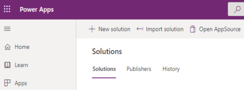
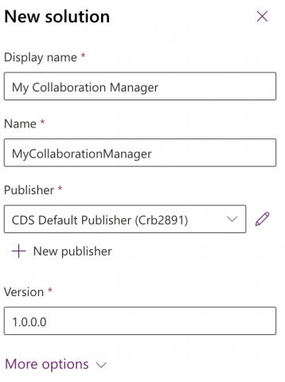
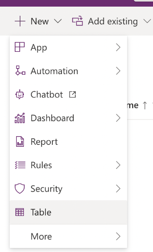
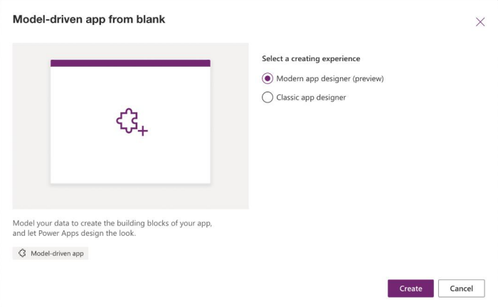
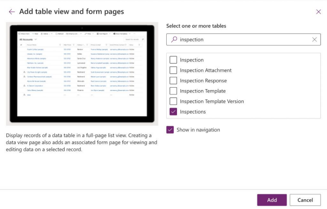
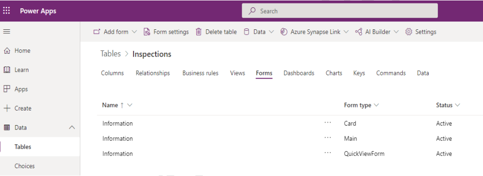

# Create a new model-driven app with Collaboration controls for Teams

## Create a model-driven application

1. Open [https://make.powerapps.com.](https://make.powerapps.com/) 

2. Select **Solutions** in the left pane.

3. Select **New solution**, so that you can provide a home for all your future customizations.

     

4. Provide the name and publisher of your new solution, this solution is going to hold your custom Collaboration Manager.

     

5. Select **Create**

6. After the solution is created, it appears in your list of solutions. Select your solution to open it.

7. Before creating your app, create a home for your data. select **New** > **Table** to get started.

       

8. Give your table a name. Under **Advanced options**, select **Creating a new activity**.

     

9. Select **Save**.

10. After you're done creating your table, you can customize it by adding extra
columns, relationships, and more (Optional).

1. Now you can create a new model-driven app by selecting **New** > **App** > **Model-driven app.**

     

2. Choose new **Modern app designer (preview)** to open the new app.

     

3. Select **Create.**

4. Give your app a name and select **Create.**

     

5. Select **Add page.**

6. Select **Table based view and form.**

     

7. Select **Next.**

8. Search and select the table you've created earlier.

     

9. Select **Add.**

10. Select **Publish** to save and publish your app.

11. Select **Play** to test out your new app.

Now you’ve successfully built a model-driven app.

## Add Collaboration controls to your application

Following are the steps to add Collaboration control capabilities such as Tasks, Meetings, Files, and Notes experiences to the app created:

1. To include the Tasks, Meetings, and Notes tabs you need to edit the Main Information form. To begin, go back to the explorer and select your solution.

1. Select the table you created in [Create a new model-driven app for Teams.](#create-a-new-model-driven-app-with-collaboration-controls-for-teams)

1. Go to the Forms tab for your table.

       

2. Select the Information form of form type **Main** to open it in the form designer.

3. Once you are in the form designer, press and drag in a **1-column tab** from the **Components** section.

       

4. After selecting the tab, rename the tab to “Tasks” in the property pane.

5. Select the tab name to select the full section and select **Expand first component to full tab** in the Properties pane. This is required as the Collaboration controls are best viewed in full tab views.

      

      

6. Expand the Collaboration (Preview) category on the controls drawer and drag the Tasks (Preview) control onto the section in Tasks form.

       

7. Set the table to Activities & select Done.

     

8. Select ‘Hide Label’ on the Properties.

       

9. The Tasks control will now display.

       

10. Repeat the Tasks steps to add Approvals, Files, Meetings and Notes controls to your app.
11. Once all controls are added, you'll see the controls rendered below in Form Designer. If a control doesn't render in Form Designer, for example shows a blank form, run your app in Power Apps and the presence of a 'configure' page or an 'empty state' means the control was successfully added.

     

12. You can now run your power app in Power Apps by selecting it.

     

13. Create a new record by selecting **+ New** and then open the record.

       

14. Now you can see views for each tab that appear similar to the following image:

       

     > **TIP**
     >
     > The controls are only visible after a record is saved in the application. If the control tabs don't appear in your record, try to refresh your browser or republish the app from Power Apps.

Now you’ve successfully added the Collaboration controls to your application. You can now run your application in Power Apps and launch the controls. As settings haven't yet been configured, you'll not be able to create entities such as Tasks, or Meetings until those are added.

## Define Settings for your Collaboration

You can define settings for Collaboration controls for the business entity such as the table created in [new model-driven app](#create-a-new-model-driven-app-with-collaboration-controls-for-teams).

The settings that you can apply are as follows:

|Settings|Used by|
|---|---|
|Group ID|Tasks, Internal Meetings, Approvals.|
|Bookings business ID|External meetings using Bookings |
|Site ID|SharePoint files |
|Drive ID|SharePoint files|

> **NOTE**
> 
> Settings are crtical to launch your app, so ensure that you follow the steps as suggested. If you have issues launching and saving the controls recheck the values.

You can get the Group ID by creating a new team or use an existing team in Microsoft Teams to host your application and create settings variables.

TODO: To create a new team, see [create a team from scratch](https://support.microsoft.com/en-us/office/create-a-team-from-scratch-174adf5f-846b-4780-b765-de1a0a737e2b).

Use the following instructions to retrieve the Group ID of your Teams team for Approvals, Tasks, and internal Meetings:

1. Find your team in your teams list.

1. Select the ellipse **...** and select **Get link to team**.

     

2. Copy the link and record the value of `groupId` from the URL. You'll use this value at a later stage while defining the settings of your solution.

     `https://teams.microsoft.com/l/team/19%3akk_TuKhjXu92yJvg4TZ10S6rouLSCgvHIb5NOOTfRjg1%40thread.tacv2/conversations?groupId=4310f270-1aa5-4089-99f3-47eb3b4d69ad&tenantId=b699419b-e0df-47e3-9909-24076fdcf68b`

Use the following instructions to retrieve the Retrieve the SharePoint Site ID and Drive ID for Files:

1. TODO: To use the Files control, you'll need to configure to an existing SharePoint site or create a new SharePoint site. To create a new site, see [create a site](/sharepoint/create-site-collection).

1. TODO: Now retrieve the Setting Values of Site ID and Drive ID, which can be called using the details in your SharePoint site.

     1. **Site ID**: Using [Graph Explorer](https://developer.microsoft.com/graph/graph-explorer), sign in and give permissions to Directory.ReadWrite.All and User.ReadWrite.All

           

     2. Ensure that you replace hostname with your hostname and relative path to the site path and make a graph call to `https://graph.microsoft.com/v1.0/sites/{hostname}:/{relative-path-to-site}`. Following is an example:
         1. If your Site URL = <https://myhostname.sharepoint.com/sites/MySiteName>
         2. Hostname = myhostname.sharepoint.com
         3. Relative path to site = sites/MySiteName

                

            Graph call would be, `https://graph.microsoft.com/v1.0/sites/myhostname.sharepoint.com:/sites/MySiteName`.

     3. The response received is a Json object representing the Site, for example Site ID would be `abcdef.sharepoint.com,0abe7394-6fce-4dcc-9884-7eaceb48cd41,8cb86762-16cd-495e-87cb-893cfdf94054`.

     4. Save the Site ID value parameter.

     5. **Drive ID**: Using [Graph Explorer](https://developer.microsoft.com/graph/graph-explorer), sign in and make the graph call to `https://graph.microsoft.com/v1.0/sites/{site-id}/drives` with the value of Site ID that you saved earlier.

     6. A Json response is returned with a parameter value of type array or list of drive objects. Look through the Json for the Json object whose name parameter matches the name of your document library. Save the value of the Drive ID parameter.

TODO: To create meetings with users outside of your organization such as customers and to use virtual visit features within your app you would need to provide a Bookings business. For more information, see [Microsoft Bookings](/microsoft-365/bookings/bookings-overview?view=o365-worldwide&preserve-view=true).

## Add Settings to your Collaboration Manager app

To apply settings and explore the collaborative features of your app in Power Apps, open the application that you've created earlier. You would see a view page, where you can select the existing records or create new one. To begin with open or create a record.

You would need to add the Settings IDs that you've saved earlier for your application

|Settings|Used by|
|---|---|
|Group ID|Tasks, internal Meetings, Approvals.|
|Bookings business ID|External meetings using Bookings |
|Site ID|SharePoint files |
|Drive ID|SharePoint files|

### Add Settings for Tasks, Meetings, and Files

1. Launch a control and you can see a window as following:

     

2. Select **Configure** and navigate to the General tab to add the Group ID.

     

3. Open Files tab to add Site ID and Drive ID.

     

The Notes control doesn't require a setting value. Now you can create entities such as Tasks and Meetings in your application. If you're facing issues launching and saving the controls recheck the settings values.

## Explore your new Collaboration Manager app

Following sections guides you on how to use the Task, Notes, Meetings, Files, and Approvals controls.

### Create Tasks

Explore collaboration in the Tasks tab by selecting the Tasks tab, which opens an empty page where users can add all the relevant tasks they need to complete.

1. To create a new task for the team, select **Add a task**. It opens a dialog where you can provide specifics about the task and assign it to the relevant people on the team and select Save.

       

2. The saved task will appear in the tasks list.

3. As all the tasks are backed by Microsoft Planner. Users can use the Tasks app within Microsoft Teams to see all the tasks that are assigned. To get started, select ellipses **…** in Teams left pane. Search and select Tasks by Planner and To Do.

       

4. After opening the Tasks by Planner and To Do app, users can see all the tasks that were created in your app within the **Assigned to me** section of the app. Users can also view the details of a task, add attachments, and mark them as complete.

### Create notes

To create a note select **Notes** tab from your app, which would redirect to an empty screen where users can provide any relevant information. To add a new note, select **New note**.
After adding relevant details in the notes, select **Save**.

### Create meetings

Select **Meetings** tab in a record to schedule both internal and external meetings.

To schedule an internal meeting, select the dropdown next to the **New meeting** button and then select **Internal meeting**.

  

> **NOTE**
>
> Customer Booking is enabled, if you have configured the Microsoft Booking with a valid setting for your app.

Within the **New meeting** dialog, users can provide relevant information about the meeting and select **Save**. The meeting appears in the meetings list.

  

TODO: To schedule an external meeting with the customer, select the dropdown next to the **New meeting** button and select **Customer Booking**. If the **Customer Booking** option isn't available in the **New Meeting** dropdown, confirm if the app is configured to Microsoft Bookings in the Settings and the user has the Bookings Administrator role. For more information, see [add staff to Bookings](/microsoft-365/bookings/add-staff?view=o365-worldwide&preserve-view=true). You can add additional booking types by adding additional services within your Bookings business.

Users can see both Internal meetings and Customer Bookings on their meeting list. After the meeting is started, users can join by selecting the **Join** button, which opens the meeting directly in Microsoft Teams.

As the meetings are backed by Outlook, users can navigate to either Bookings, or Outlook Calendar to see all the meetings listed in a single calendar. Internal meetings are listed in shared calendar.

Following are the steps to add a shared calendar to your Outlook (optional) :

1. On the Home tab of the ribbon, in the **Manage Calendars** section, select **Open Calendar** > **Open Shared Calendar**.

2. In the **Open a Shared Calendar** dialog , enter the person's name. Select the person you're looking for and then select **OK**.

In the left Pane, under **Shared Calendars** you should now see an additional calendar with the person's name.

  

### Add files

Open the **Files** tab in your application and select **Upload** to upload files from OneDrive for Business or from your computer. When a file is successfully uploaded, the main list view automatically refreshes to show the files in the list.

### Approvals

Approvals allow users to request sign out from others when working in a record. For example, request an approval to complete a task or close a record.

1. Go to the **Approvals** tab of the application.

1. When there are no approval requests, users see the following screen.

      

2. Select the **New approval request** to open the approval request form.

        

3. In the Approval request form, fill the required fields and select **Send**,which creates a request and added to the list.

      

4. Select the approval to view the details.
